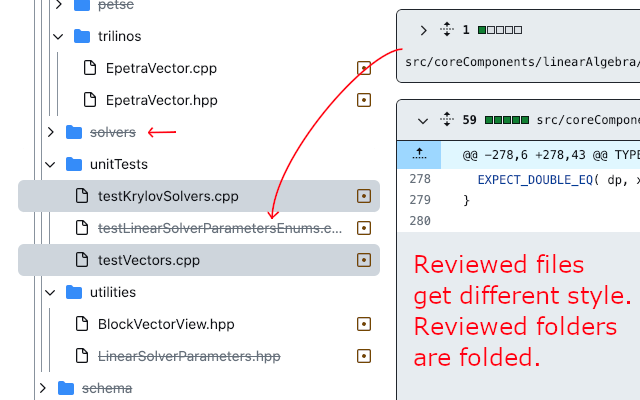
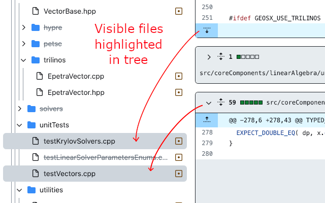
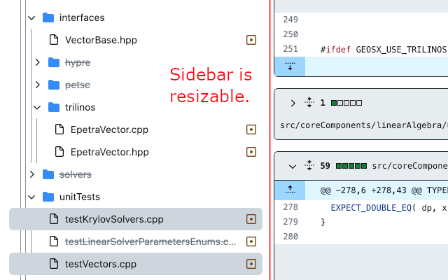

UI improvements to GitHub PRs
- Adapts the PR sidebar to the lengths of the file names;
- Lets you resize the sidebar yourself;
- Dims and folds reviewed files and folders in the pull request tree;
- Highlights in the tree the visible files you're reviewing on the right pane.

Pin the extension and select the options that suit you!

     
    <em>Strike through reviewed files. Fold reviewed folders!</em>

     
    <em>Visible files in the right pane are highlighted in the tree.</em>

     
    <em>Sidebar can be resized (manually or automatically).</em>

